# Safe Remote Purchase

### Authors  
1. Pavan R Shetty (4NM17CS122)
2. Mohammed Akzar A K (4NM17CS106)
3. Mohammed Sharhan Marakada (4NM17CS107)

## Introduction

Purchasing goods remotely currently requires multiple parties that need to trust each other. The simplest configuration involves a seller and a buyer. The buyer would like to receive an item from the seller and the seller would like to get money (or an equivalent) in return. The problematic part is the shipment here: There is no way to determine for sure that the item arrived at the buyer.<br><br>
There are multiple ways to solve this problem, but all fall short in one or the other way. Use in our program, both parties have to put twice the value of the item into the contract as escrow. As soon as this happened, the money will stay locked inside the contract until the buyer confirms that they received the item. After that, the buyer is returned the value (half of their deposit) and the seller gets three times the value (their deposit plus the value). The idea behind this is that both parties have an incentive to resolve the situation or otherwise their money is locked forever.<br><br>
      
## Program

```
pragma solidity ^0.5.0;

contract Purchase {
    uint public value;
    address payable public seller;
    address payable public buyer;

    enum State { Created, Locked, Release, Inactive }
    // The state variable has a default value of the first member, `State.created`
    State public state;

    modifier condition(bool _condition) {
        require(_condition);
        _;
    }

    modifier onlyBuyer() {
        require(
            msg.sender == buyer,
            "Only buyer can call this."
        );
        _;
    }

    modifier onlySeller() {
        require(
            msg.sender == seller,
            "Only seller can call this."
        );
        _;
    }

    modifier inState(State _state) {
        require(
            state == _state,
            "Invalid state."
        );
        _;
    }

    event Aborted();
    event PurchaseConfirmed();
    event ItemReceived();
    event SellerRefunded();

    // Ensure that `msg.value` is an even number.
    // Division will truncate if it is an odd number.
    // Check via multiplication that it wasn't an odd number.
    constructor() payable {
        seller = msg.sender;
        value = msg.value / 2;
        require((2 * value) == msg.value, "Value has to be even.");
    }

    /// Abort the purchase and reclaim the ether.
    /// Can only be called by the seller before
    /// the contract is locked.
    function abort()
        public
        onlySeller
        inState(State.Created)
    {
        emit Aborted();
        state = State.Inactive;
        // We use transfer here directly. It is
        // reentrancy-safe, because it is the
        // last call in this function and we
        // already changed the state.
        seller.transfer(address(this).balance);
    }

    /// Confirm the purchase as buyer.
    /// Transaction has to include `2 * value` ether.
    /// The ether will be locked until confirmReceived
    /// is called.
    function confirmPurchase()
        public
        inState(State.Created)
        condition(msg.value == (2 * value))
        payable
    {
        emit PurchaseConfirmed();
        buyer = msg.sender;
        state = State.Locked;
    }

    /// Confirm that you (the buyer) received the item.
    /// This will release the locked ether.
    function confirmReceived()
        public
        onlyBuyer
        inState(State.Locked)
    {
        emit ItemReceived();
        // It is important to change the state first because
        // otherwise, the contracts called using `send` below
        // can call in again here.
        state = State.Release;

        buyer.transfer(value);
    }

    /// This function refunds the seller, i.e.
    /// pays back the locked funds of the seller.
    function refundSeller()
        public
        onlySeller
        inState(State.Release)
    {
        emit SellerRefunded();
        // It is important to change the state first because
        // otherwise, the contracts called using `send` below
        // can call in again here.
        state = State.Inactive;

        seller.transfer(3 * value);
    }
}
```

## Implementation

You can use a smart contract as an agreement between a seller and a buyer when planning a remote purchase. In this section, we will show you how to do that using an Ethereum contract example.
The main idea is that both seller and buyer send double the value of the item in Ether. When the buyer receives it, they get half of their Ether back. The other half is sent to the seller as payment. Therefore, the seller receives triple the value of their sale, as they also get their Ether refunded.

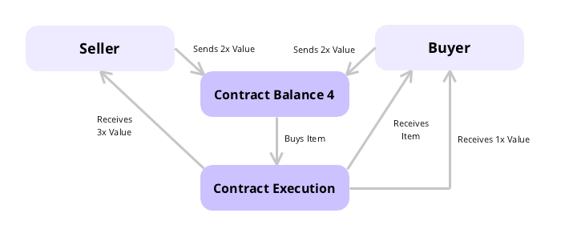

This smart contract also lets both sides block the refund. The pattern you should use for that is the same as withdrawing.

As usual, we start with stating the version pragma and listing the details of our contract:

```
pragma solidity >=0.4.22 <0.7.0;

contract Purchase {
    uint public value;
    address payable public seller;
    address payable public buyer;
    enum State { Created, Locked, Inactive }
    State public state;
   ```
   
Next, we will use function modifiers to validate input. We also create three possible events:
Aborted(); will trigger if any party cancels the purchase.
PurchaseConfirmed(); will trigger when the buyer confirms the purchase.
ItemReceived(); will trigger when the buyer receives the item they bought.

```
constructor() public payable {
        seller = msg.sender;
        value = msg.value / 2;
        require((2 * value) == msg.value, "Value has to be even.");
    }

    modifier condition(bool _condition) {
        require(_condition);
        _;
    }

    modifier onlyBuyer() {
        require(
            msg.sender == buyer,
            "Only buyer can call this."
        );
        _;
    }

    modifier onlySeller() {
        require(
            msg.sender == seller,
            "Only seller can call this."
        );
        _;
    }

    modifier inState(State _state) {
        require(
            state == _state,
            "Invalid state."
        );
        _;
    }

    event Aborted();
    event PurchaseConfirmed();
    event ItemReceived();
```
    
Before the contract locks, the seller can still abort the sale and reclaim their Ether:

```
function abort()
        public
        onlySeller
        inState(State.Created)
    {
        emit Aborted();
        state = State.Inactive;
        seller.transfer(address(this).balance);
    }
 ``` 
To confirm the sale, the buyer calls confirmPurchase(). Their transaction has to include double the value of the item in Ether (2 * value):
```
function confirmPurchase()
        public
        inState(State.Created)
        condition(msg.value == (2 * value))
        payable
    {
        emit PurchaseConfirmed();
        buyer = msg.sender;
        state = State.Locked;
    }
```
The contract will keep the Ether locked until the buyer calls confirmReceived(). By doing that and confirming the purchased item reached them, the buyer releases the Ether:
```
function confirmReceived()
        public
        onlyBuyer
        inState(State.Locked)
    {
        emit ItemReceived();
        state = State.Inactive;
        buyer.transfer(value);
        seller.transfer(address(this).balance);
    }
}
```
### This program is executed in two environments.
1. JVM
2. Injected Web

## JVM
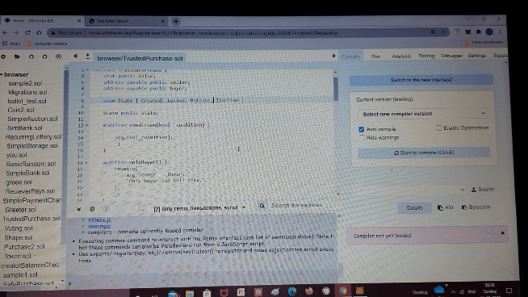
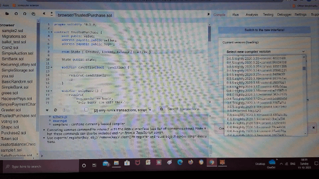
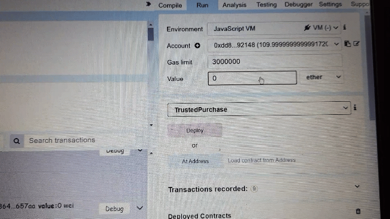
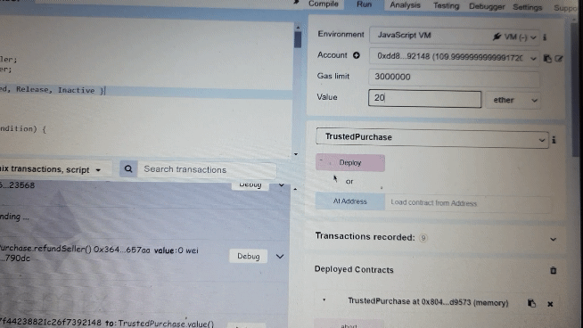

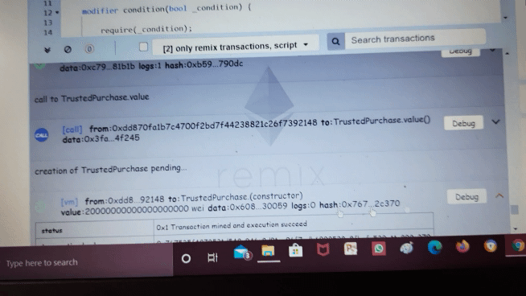
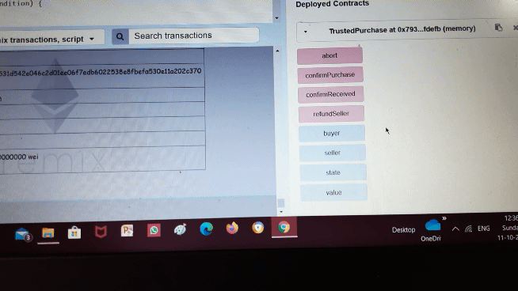
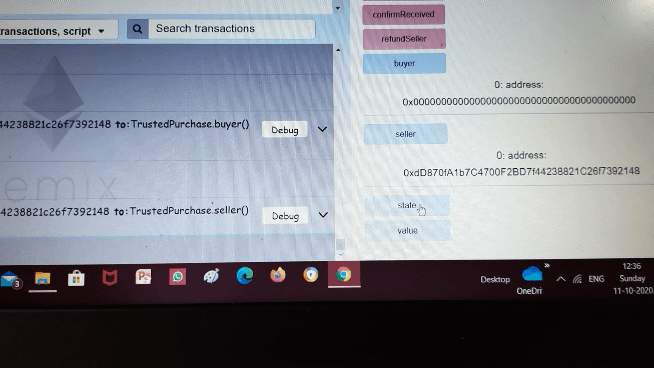

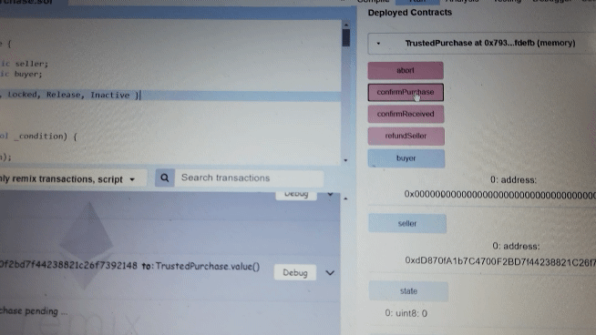

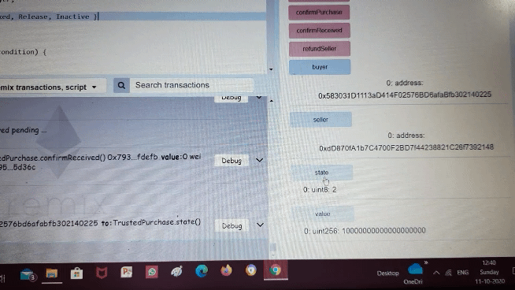

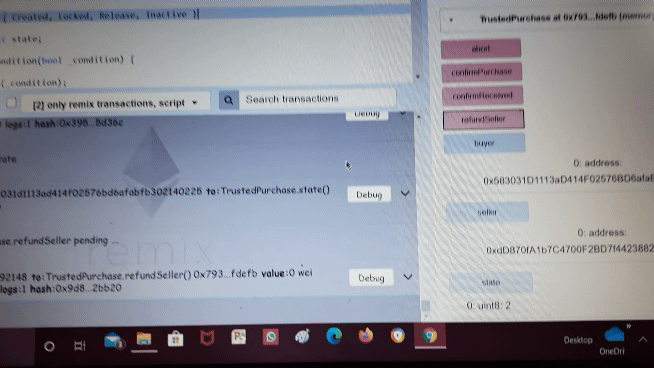
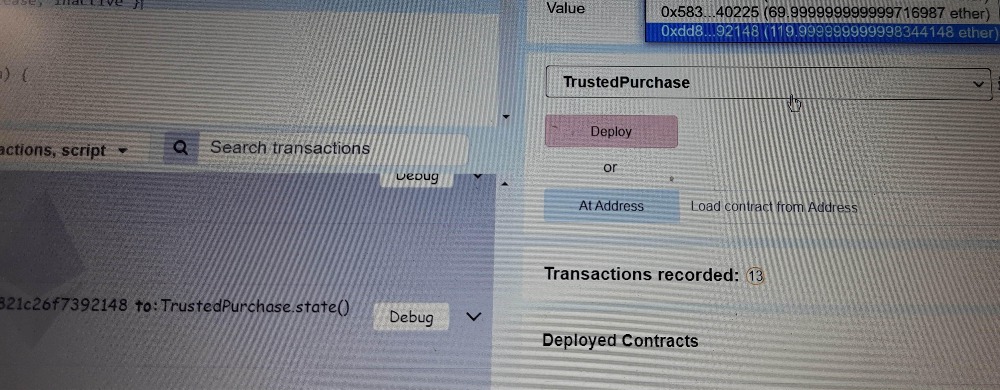

## Injected Web
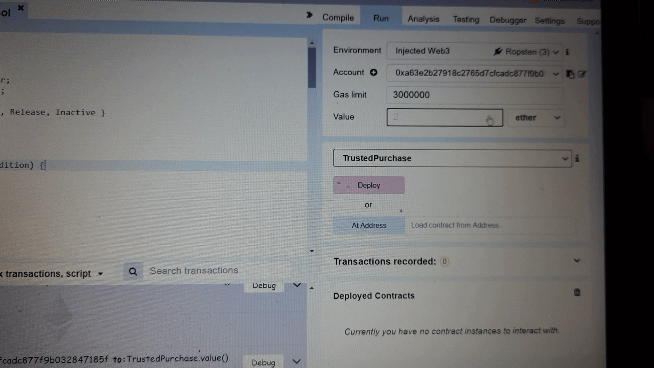
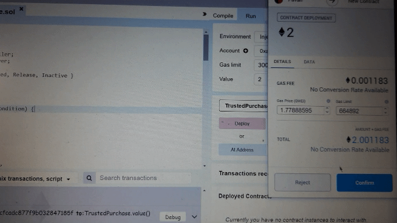
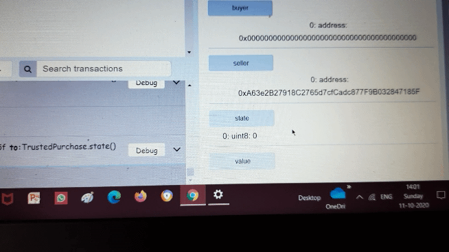
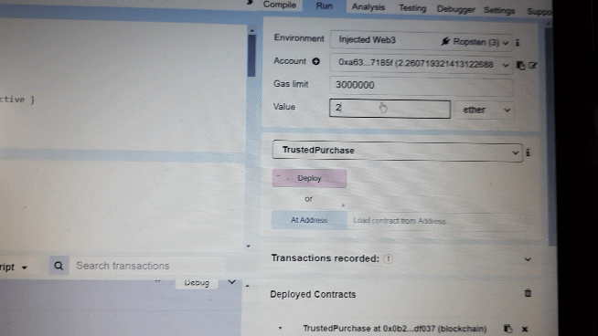
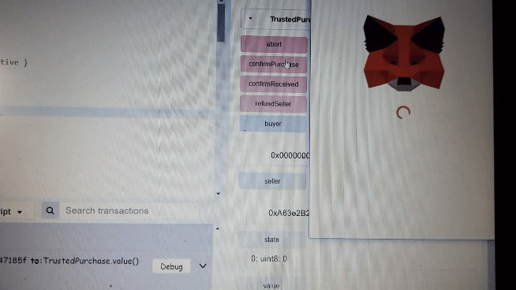
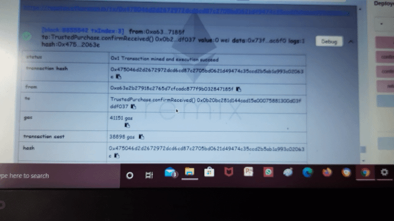
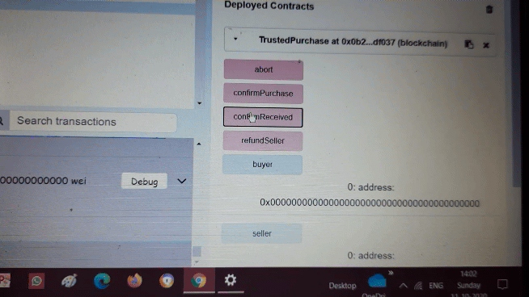
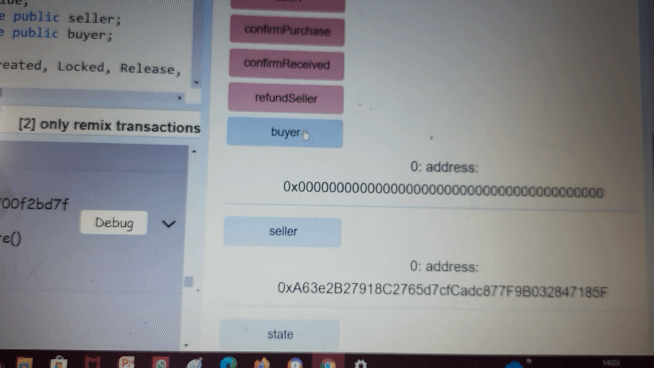
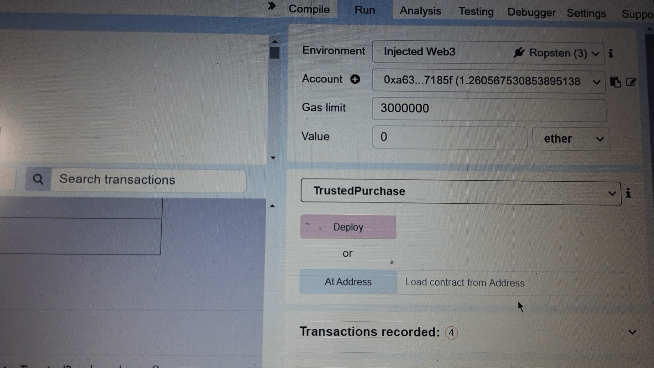
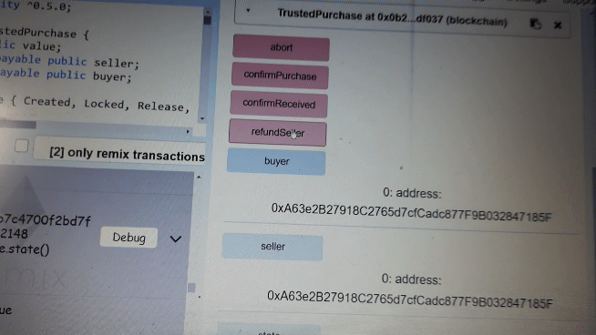
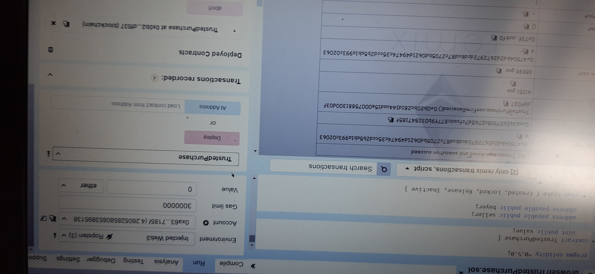

## Conclusion
Approved Account Transaction Implemented.
